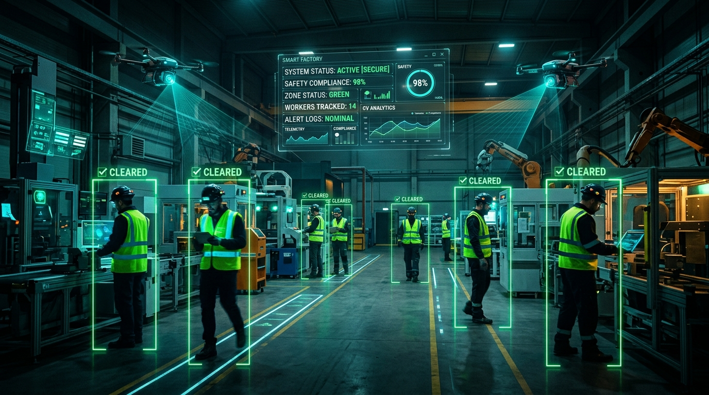

# 🛡️ SafeVision AI: Industrial Safety Gear Compliance & Hazard Detection



An AI-powered edge-to-cloud industrial safety monitoring system built for the **STPI & EmTek BPUT Hackathon**.


---

## 🌟 Key Features

1. **PPE Compliance Detection**: Real-time worker monitoring for hardhats/helmets, high-visibility vests, and protective gear.
2. **Hazard Detection**: Early detection of fire and smoke to prevent industrial disasters.
3. **Smart Audible Siren & TTS**: External speaker integration with industrial siren tones and text-to-speech voice warnings (*"Alert: No helmet in Zone 1"*).
4. **Multi-Device Edge Setup**:
   - 📱 **Mobile Phone**: Wireless IP CCTV camera on the factory floor.
   - 💻 **Laptop 1**: AI Edge inference engine & audio alarm driver.
   - 💻 **Laptop 2**: Central Command Center & Safety Officer Dashboard.
   - 🔊 **Speaker**: Physical audible alert unit.
5. **Advanced Construction & Industrial AI Modules (NEW)**:
   - 🏗️ **Height Safety & Harness Compliance**: OSHA 1926 Subpart M harness strap & tether verification at elevated decks.
   - 📦 **Crane Suspended Load "Drop Zone"**: Projects dynamic circular radar drop shadows beneath hoisted loads and alerts workers in the line of fire.
   - 🚪 **Confined Space Headcount & Stay-Timer**: Automatic entry/exit counting & max stay duration timers for tanks/manholes.
   - ⚡ **Hot Work & Fire Extinguisher Watch**: Detects welding sparks and verifies certified extinguisher proximity (< 5m).
   - ⚠️ **Trench Margin & 🌙 Night Guard**: Alerts cave-in risk near trench lips & enforces tactical after-hours perimeter security.
6. **Automated Audit Reports**: One-click generation of executive **PDF Safety Compliance Reports** and **CSV Incident Logs**.

---

## 🚀 Quick Start Guide

### 1. Install Dependencies
```bash
pip install -r requirements.txt
```

### 2. Connect Your Mobile Camera with DroidCam (Recommended)
#### **Mode A: Wireless Wi-Fi Connection**
1. Connect your **Laptop** and **Phone** to the same Wi-Fi or Mobile Hotspot.
2. Open the **DroidCam** app on your phone.
3. Note the **WiFi IP** and **Port** shown on screen (e.g., `192.168.43.15` and port `4747`).
4. In the SafeVision AI Dashboard, enter `http://192.168.43.15:4747/video` in the **Quick Connect** box (or just click ⚙️ **Camera Source** -> **DroidCam Wi-Fi**).

#### **Mode B: Ultra-Low Latency USB Cable Connection (Zero-Lag)**
1. Connect your phone to your laptop with a USB cable.
2. Open DroidCam on your phone and start the DroidCam Windows client on your PC.
3. In the SafeVision AI Dashboard, enter `1` (or click ⚙️ **Camera Source** -> **USB Mode**).

### 3. Plug in Your Speaker
- Connect your external speaker to Laptop 1 via 3.5mm Aux jack or Bluetooth.

### 4. Run the System
```bash
python run.py
```
- **On Laptop 1:** Open `http://localhost:8000`
- **On Laptop 2 (Control Room):** Open `http://<Laptop1_IP>:8000` (e.g., `http://192.168.43.100:8000`)
- In the dashboard, enter your mobile camera URL in the **Quick Connect** box and click **Switch Feed**.

---

## 🎙️ Hackathon Demo Pitch (How to Present to Judges)

1. **The Problem:** Manual CCTV monitoring in factories fails due to human fatigue. When a worker forgets a helmet or a fire starts, delays cause fatalities.
2. **The Solution:** SafeVision AI uses edge computer vision to detect violations within 100ms, immediately warns the worker via audible speaker, and notifies safety managers in the control room.
3. **Live Demonstration:**
   - Show normal safe feed (100% compliance).
   - Walk in front of camera without helmet -> **Speaker blares audible voice alarm + snapshot appears on Laptop 2.**
   - Show fire flame -> **Critical hazard alarm triggers instantly.**
   - Click **"Export PDF Audit Report"** to show enterprise readiness.
